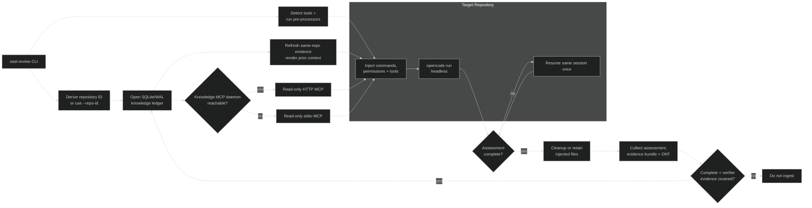
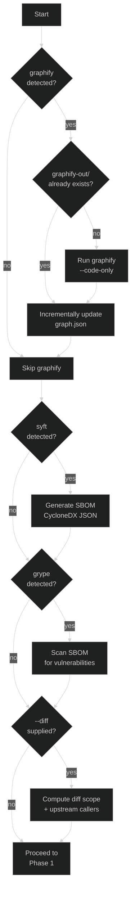
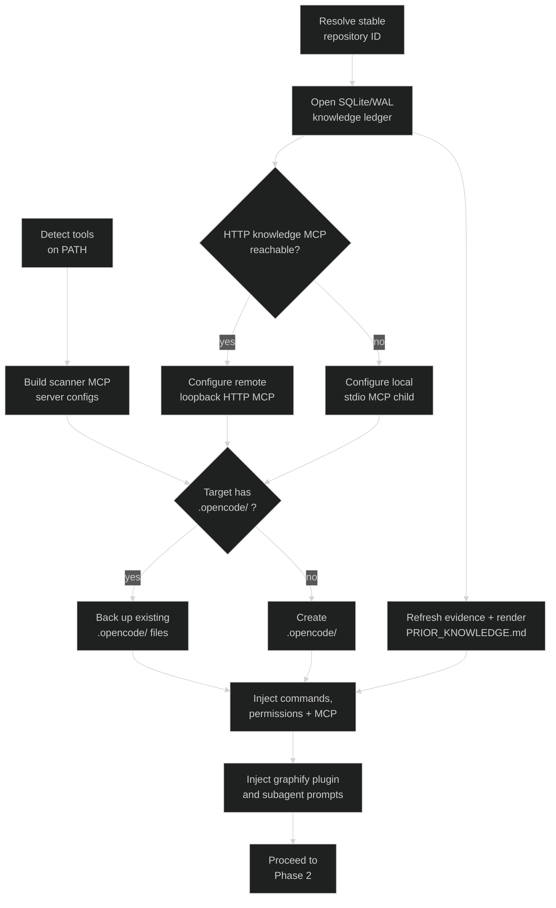
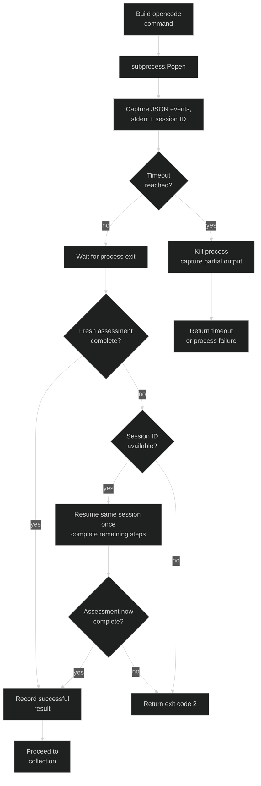
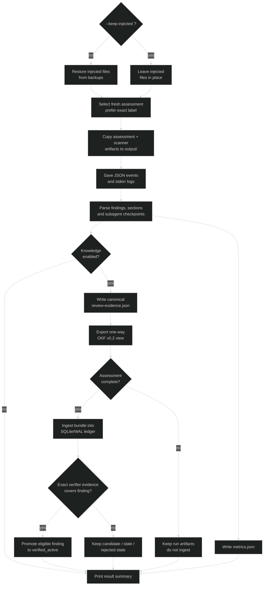
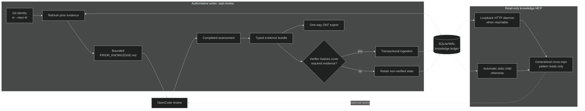
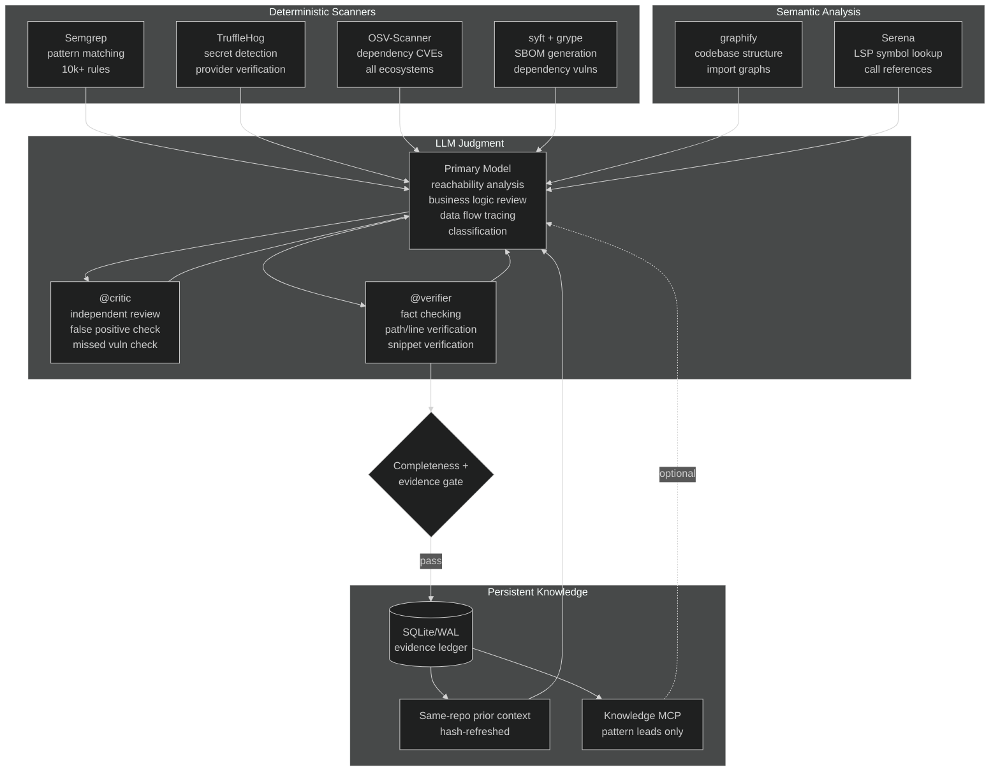

# LASER

**LLM-Augmented Security Evaluation & Review**

The LASER projectis a universal, repository-agnostic security review runner. All you need is to  points it at any cloned repository and it takes care of the rest — it discovers which
security tools are available on the machine, injects its own configuration into
the target project, orchestrates a fully headless review session through
[OpenCode](https://opencode.ai), and at the end collects the structured results
into a clean output directory.

There are no ground-truth files to maintain, no coupling to a specific
benchmark suite. It works on any codebase, in any language that the underlying
tools and models can handle. And it works with local LLMs too! Tested with llama.cpp on Linux AMD w/ Vulkan and oMLX on MacOS M3 Pro.

## Table of contents

- [Prerequisites](#prerequisites)
- [Quick start](#quick-start)
- [Architecture overview](#architecture-overview)
- [How a review works](#how-a-review-works)
  - [Phase 0 — Pre-processing](#phase-0--pre-processing)
  - [Phase 1 — Tool detection and injection](#phase-1--tool-detection-and-injection)
  - [Phase 2 — Headless execution](#phase-2--headless-execution)
  - [Phase 3 — The security review workflow](#phase-3--the-security-review-workflow)
  - [Phase 4 — Collection and cleanup](#phase-4--collection-and-cleanup)
- [Persistent review knowledge](#persistent-review-knowledge)
- [Tool roles](#tool-roles)
- [Scoped permissions](#scoped-permissions)
- [Classification system](#classification-system)
- [Output structure](#output-structure)
- [CLI reference](#cli-reference)
- [Project layout](#project-layout)

---

## Prerequisites

**Required:**

- Python 3.13+
- [uv](https://docs.astral.sh/uv/) for dependency management
- [OpenCode](https://opencode.ai) CLI (`opencode` on PATH), version 1.18+
- A running LLM provider (llama.cpp, LM Studio, oMLX, or any OpenAI-compatible)

**Security tools (auto-detected, all optional — the review degrades gracefully
when any of them is missing):**

| Tool | Purpose | Install |
|------|---------|---------|
| [graphify](https://github.com/nicobailey/graphify) | Codebase knowledge graph | `uv tool install "graphifyy[openai]"` |
| [Semgrep](https://semgrep.dev) | Deterministic SAST, 10k+ rules | `brew install semgrep` |
| [Serena](https://github.com/JetBrains/serena) | LSP-powered semantic navigation | `uv tool install -p 3.13 serena-agent` |
| [TruffleHog](https://github.com/trufflesecurity/trufflehog) | Secret scanning with verification | `brew install trufflehog` |
| [OSV-Scanner](https://google.github.io/osv-scanner/) | Dependency vulnerability scanning | `brew install osv-scanner` |
| [syft](https://github.com/anchore/syft) | SBOM generation (CycloneDX) | `brew install syft` |
| [grype](https://github.com/anchore/grype) | Vulnerability scanning against SBOMs | `brew install grype` |

To install everything at once:

```bash
brew install semgrep osv-scanner syft grype trufflehog
uv tool install "graphifyy[openai]"
uv tool install -p 3.13 serena-agent
```

---

## Quick start

```bash
cd /path/to/cloned/sast-review

# Install dependencies
uv sync

# See what tools are available
uv run sast-review --list-tools --repo /path/to/any/repo

# Run a single security review
uv run sast-review --repo /path/to/any/repo

# Run with a specific model
uv run sast-review --repo /path/to/any/repo --model galileo/coder-ornith:LATEST

# Benchmark multiple models sequentially
uv run sast-review --repo /path/to/any/repo --benchmark \
  --models "galileo/coder-ornith:LATEST,galileo/coder-qwen3-30b:LATEST"

# Optional: keep a shared read-only knowledge MCP daemon running
# (reviews automatically use a local stdio MCP fallback when it is absent)
uv run sast-review-knowledge

# Optionally override the repository UUID derived from Git
uv run sast-review --repo /path/to/any/repo \
  --repo-id 550e8400-e29b-41d4-a716-446655440000
```

Persistent knowledge is enabled by default. LASER derives a clone-stable UUID
from the sanitized Git origin, falling back to root commits for full local
repositories. `--repo-id` overrides that identity when repositories intentionally
need to share or separate knowledge or when a shallow repository has no origin;
`--no-knowledge` disables retrieval and ingestion.

---

## Architecture overview



---

## How a review works

A single run of `sast-review` passes through four distinct phases. Each one is
described below together with the exact operations it performs — because in
security tooling, transparency about what happens under the hood is not a
luxury but a requirement.

### Phase 0 — Pre-processing



Before the LLM even begins its work, three independent pre-processing steps
run to prepare the whole playground.

#### Graphify (structural analysis)

When `graphify` is installed and no `graphify-out/graph.json` exists yet, the
runner invokes `graphify <repo> --code-only` by default. This performs a purely
structural, AST-based analysis of the codebase — fast and lightweight. When a
graph already exists, the runner invokes `graphify update <repo>` rather than
trusting it unchanged, so prior reachability context tracks the current worktree.

The output consists of `graphify-out/graph.json` and
`graphify-out/manifest.json`, which together describe file-to-file import
relationships, module community detection, entry point identification, and
symbol-level call edges. This structural map becomes invaluable later when the
model needs to trace data flow across multiple files or identify dead code.

When one passes `--graphify-full`, the runner instead invokes graphify's
complete pipeline, which includes LLM-powered semantic extraction. This
requires a running LLM backend — the runner points graphify at the same
provider and model that the primary reviewing agent uses. The result is a
richer graph with semantic annotations, but at the cost of additional
inference time and the requirement that the LLM be reachable.

#### Syft + Grype (SBOM and dependency vulnerabilities)

When `syft` is present, the runner generates a CycloneDX SBOM:

```bash
syft dir:<repo> -o cyclonedx-json=.security-output/sbom.cyclonedx.json
```

Syft is thorough in a way that lockfile-only scanners are not — it detects
packages across all ecosystems, including vendored dependencies, compiled
binaries, OS-level packages, and container layers.

If `grype` is also available, it immediately scans the SBOM for known
vulnerabilities:

```bash
grype sbom:.security-output/sbom.cyclonedx.json -o json
```

Both (JSON) outputs land in `.security-output/` where the reviewing model can read
them. The SBOM is additionally collected as a persistent artifact alongside the
final assessment, which satisfies SBOM compliance requirements without any
extra effort.

Now, let's briefly talk about the relationship between these tools and OSV-Scanner:
OSV-Scanner operates during the review itself as an MCP tool that the model
calls interactively, while Syft and Grype run beforehand as a pre-processing
step. They complement each other well — Syft catches packages that
OSV-Scanner's lockfile parsing would otherwise miss (vendored code, transitive
dependencies, binaries), and OSV-Scanner provides the model with interactive
querying capabilities during the review.

#### Diff scope (incremental scanning)

When one passes `--diff [REF]`, the runner computes which files have changed
since the given git reference (by default: `HEAD~1`):

```bash
git diff --name-only --diff-filter=ACMRT <ref>
```

It then identifies the upstream callers of those changed files — preferably
from graphify's `graph.json` if it exists (which provides actual import edges),
or otherwise through a grep-based fallback. The combined scope is written to
`.security-output/DIFF_SCOPE.md`, where the reviewing model will discover it
and prioritise those files accordingly.

This is the single most effective token-savings optimisation for repeated
scans. In a repository of a hundred files where only three have changed, the
model ends up reviewing perhaps ten files instead of the full hundred.

### Phase 1 — Tool detection and injection



**Tool detection** works by scanning PATH for each tool's binary and verifying
that it responds correctly:

| Tool | Binary | Verification | Integration |
|------|--------|-------------|-------------|
| graphify | `graphify` | `graphify --version` | Pre-processor (AST/structural) |
| syft | `syft` | `syft --version` | Pre-processor (SBOM generation) |
| grype | `grype` | `grype --version` | Pre-processor (SBOM vulnerability scan) |
| Semgrep | `semgrep` | `semgrep mcp --version` | MCP: `semgrep mcp` (stdio) |
| Serena | `serena` | `serena --version` | MCP: `serena start-mcp-server --project <repo>` (stdio) |
| TruffleHog | `trufflehog` | `trufflehog --version` | Pre-processor: `trufflehog filesystem <repo> --json` |
| OSV-Scanner | `osv-scanner` | `osv-scanner --version` | MCP: `osv-scanner experimental-mcp` (stdio) |

**Injection** then copies a set of files into the target repository's
`.opencode/` directory. The philosophy here is straight: the runner
temporarily transforms any repository into one that knows how to conduct a
security review of itself.

1. **Command templates** — `security-review.md` and `security-review-ref.md`
   are placed into `.opencode/commands/`. Together they define the entire review
   workflow and the classification reference specification that governs how
   findings are categorised.

2. **Scoped permissions** — these are merged into `.opencode/opencode.json` and
   control precisely what the model is and is not allowed to do during headless
   execution (see [Scoped permissions](#scoped-permissions) further below).

3. **MCP server entries** — each detected MCP-capable scanner is added to
   `.opencode/opencode.json`. Persistent knowledge uses the read-only loopback
   HTTP daemon when reachable, otherwise the runner configures an automatic
   local stdio child against the same SQLite ledger.

4. **Subagent prompts** — `critic-prompt.txt` and `verifier-prompt.txt` are
   copied into `.security-output/`. The model reads these files at Steps 11
   and 12, respectively. The reason they live as separate files rather than
   being inlined in the command template is deliberate: by the time the model
   reaches the subagent steps, it may have consumed tens of thousands of tokens
   of source code and tool output. A file read places the prompt text fresh in
   the most recent context window, where the model's attention is strongest.

5. **Graphify plugin** — when graphify has been detected, `plugins/graphify.js`
   is copied to `.opencode/plugins/` and registered. This plugin injects a
   one-time reminder into the first bash command instructing the model to use
   `graphify query` for focused lookups rather than reading raw graph files.

**Backup and restore:** Every file that already exists in the target's
`.opencode/` directory is copied to a `.sast-backup` file before being
overwritten. During cleanup in Phase 4, originals are restored and any files
that were injected into previously empty paths are removed. This ensures the
target repository is left exactly as it was found, even if the review crashes
or times out halfway through.

### Phase 2 — Headless execution



At this point the runner hands control to OpenCode by executing:

```bash
opencode run \
  --command security-review \
  --model <provider/model> \
  --auto \
  --format json \
  --print-logs \
  --dir <target-repo> \
  <label>
```

Each flag serves a specific purpose:

| Flag | Purpose |
|------|---------|
| `--command security-review` | Invokes the injected `/security-review` command |
| `--model <provider/model>` | Sets the primary agent's LLM (e.g., `galileo/coder-ornith:LATEST`) |
| `--auto` | Auto-approves permissions not explicitly denied (required — see below) |
| `--format json` | Emits structured JSON events on stdout for programmatic capture |
| `--print-logs` | Routes logs to stderr, prevents a known hang bug (#27387) |
| `--dir <target-repo>` | Sets the working directory to the target repository |
| `<label>` | Passed as `$1` to the command template — used in the output filename |

**Why `--auto` is required:** This deserves a brief explanation. OpenCode
permissions that resolve to `ask` in headless mode will hang indefinitely (OpenCode owes me few nighttime shifts) — there is no TTY to prompt the user, no timeout mechanism, no fallback
(GitHub issue #36762). The `--auto` flag converts any residual `ask`
permissions to `allow`, but crucially, the explicit `deny` rules in the
injected permission set are always enforced regardless. This gives us a
workable middle ground: the model can freely read files, search, and run
diagnostic commands, but it cannot delete files, modify source code, or
execute destructive operations. I could not let this go.

**Timeout:** By default there is no timeout — the review simply runs until
completion. One can set a hard limit with `--timeout <seconds>`, in which case
the process is killed when the limit is reached and whatever partial output
exists is captured. If OpenCode exits successfully with an incomplete fresh
assessment, the runner resumes the same session once to finish the remaining
contract steps. A missing or still-incomplete assessment returns exit code 2;
stale assessment files from earlier runs are never accepted.

**Headroom:** When `headroom` is found on PATH, the runner wraps the command
as `headroom wrap opencode run ...` to benefit from prompt caching and
compression. This can be disabled with `--no-headroom`.

### Phase 3 — The security review workflow

This is the heart of the system — the work that the LLM actually performs
during headless execution. The command template defines a strict sequential
workflow: no steps may be skipped, no steps may be reordered, and the
sub-agent delegation at the end is enforced through checkpoint gates that
the model must write before it can proceed. Without such harness, some models "decided" that they didn't need to follow the steps and delegate stuff to sub-agents.

```mermaid
%%{init: {"theme": "dark"}}%%
flowchart TD
    S1["Step 1<br/>mkdir .security-output"] --> S2["Step 2<br/>Write assessment header"]
    S2 --> S2b["Step 2b<br/>Read README + deploy configs<br/>Write ## Context"]
    S2b --> S3["Step 3<br/>Read graphify-out<br/>if present"]
    S3 --> S3b["Step 3b<br/>Tool-assisted scans<br/>semgrep / trufflehog / serena"]
    S3b --> S3c["Step 3c<br/>Read bounded prior context<br/>ACTIVE / STALE / pattern leads"]
    S3c --> S4["Step 4<br/>Map attack surface<br/>entry points + trust boundaries"]
    S4 --> S4b["Step 4b<br/>Attack-path tracing<br/>dead-code detection<br/>via graphify"]
    S4b --> S5["Step 5<br/>List source files<br/>exclude tests/vendor/generated"]
    S5 --> S6["Step 6<br/>Prioritised scan<br/>attack paths first"]
    S6 --> S7["Step 7<br/>Dependency scan<br/>osv-scanner or manual"]
    S7 --> S8["Step 8<br/>Write summary tables"]
    S8 --> S9["Step 9<br/>Self-check: verify<br/>all sections exist"]
    S9 --> S10["Step 10<br/>Confirm file saved"]
    S10 --> S10b["Step 10b<br/>Unload primary model<br/>free GPU for subagents"]
    S10b --> S11["Step 11<br/>Invoke @critic"]
    S11 --> S11b["Step 11b<br/>Process critic feedback<br/>write checkpoint"]
    S11b --> S12["Step 12<br/>Invoke @verifier"]
    S12 --> S12b["Step 12b<br/>Process verifier feedback<br/>write checkpoint"]
    S12b --> S13["Step 13<br/>Write validation section<br/>from checkpoint data"]
    S13 --> S13b["Step 13b<br/>Write run metadata"]
    S13b --> S14["Step 14<br/>Report summary to chat"]
```



#### Step 1 — Create output directory

```bash
mkdir -p .security-output
```

This creates the directory where the assessment file will be written. The
scoped permissions ensure that this is the only directory the model may write
to.

#### Step 2 — Write assessment header

The model writes the initial header line to
`.security-output/SEC_ASSESSMENT_<label>.md`:

```
# Security Assessment — 2026-08-30 — coder_ornith
```

The label is derived from the model name (for instance,
`galileo/coder-ornith:LATEST` becomes `coder_ornith`) unless explicitly
provided via the `--label` flag.

#### Step 2b — Repository context

Before examining any source code, the model first builds an understanding of
what the project actually is. It reads the repository's README (the first 120
lines) and scans the root directory for deployment configuration files —
Dockerfiles, docker-compose files, uwsgi configs, Procfiles, Kubernetes
manifests, serverless configurations, and so on. From these it constructs a
`## Context` section that covers:

- **Project** — name and a one-line description
- **Language/framework** — for example, Python 3.x with Flask
- **Purpose** — what the application does, in a sentence or two
- **Deployment** — how it is meant to run (Docker, uwsgi, serverless, etc.)
- **Ports/services** — exposed ports and backing services
- **Auth model** — the authentication mechanism (sessions, JWT, API keys)
- **Data stores** — databases, caches, object stores
- **External integrations** — third-party APIs
- **Notes** — anything else that is security-relevant (debug mode, CORS, etc.)

This section serves a dual purpose: it gives human readers immediate context
before they encounter any findings, and it gives the model itself a mental
model of the system before it begins scanning. The step is constrained to at
most five tool calls — one README read, one directory listing, and up to three
deployment config reads.

#### Step 3 — Read graphify knowledge graph

The model checks whether `graphify-out/GRAPH_REPORT.md` and
`graphify-out/graph.json` exist. If they are present (either from Phase 0
pre-processing or from a previous graphify run), the model reads both files.
This gives it a structural overview of the codebase — modules, communities,
relationships — along with entry point identification from static analysis
and import/call graphs that will be essential for understanding data flow
paths later on.

If graphify output is not available, the model simply notes this in the
assessment and proceeds. The review remains valid; it is merely slower to
build context without the structural map.

#### Step 3b — Tool-assisted baseline scans

This step runs conditionally, depending on which MCP tools are available to
the session.

**Semgrep**, if present, globs for source files and then calls `semgrep_scan`
via MCP with up to 50 files. Semgrep applies thousands of deterministic rules
across more than thirty languages, producing a baseline of pattern-matched
findings. These are saved to `## Semgrep baseline` in the assessment. The
model will use them as a starting point in Step 6 — they are pre-confirmed
patterns, but the model must still verify reachability and classify each one
on all four axes.

**TruffleHog**, if present, has already run as a pre-processing step; the
model reads the results from `.security-output/trufflehog-results.json` and
summarises them into `## Secret scan baseline` with redacted values.
TruffleHog supports over 800 credential detectors and is able to verify
whether discovered credentials are still live against their respective
providers.

**Serena**, if present, is called to run `get_symbols_overview` on the main
entry-point files. Unlike grep-based searching, Serena understands type
hierarchies, method resolution, and cross-file symbol references through its
LSP integration. The model uses `find_referencing_symbols` later in Step 6 to
verify that data actually flows through each hop in a trace.

#### Step 3c — Pre-processing artifacts

The runner may have generated several artifacts before the review started, and
this step checks for their presence:

- **SBOM** (`sbom.cyclonedx.json`) — a complete inventory of all packages,
  referenced later in Step 7 for dependency scanning.
- **Grype results** (`grype-results.json` and `grype-summary.json`) —
  pre-scanned dependency vulnerabilities. The runner generates a compact
  summary containing only the fields the model needs: package name, version,
  CVE identifier, severity, fixed-in version, and a short description. The
  model reads this summary — not the full results file — and writes a
  `## Dependency scan baseline` table. These findings feed into Step 6 (files
  importing vulnerable packages are prioritised) and Step 7 (merged with
  OSV-Scanner results).
- **Diff scope** (`DIFF_SCOPE.md`) — when `--diff` was used, this file lists
  the changed files together with their upstream callers. The model prioritises
  these in Steps 5 and 6.

In the situation where Semgrep found nothing but Grype did find
vulnerabilities, the dependency scan becomes the primary signal for the review,
alongside whatever structural analysis graphify was able to provide.

#### Step 4 — Map the attack surface

The model now identifies and documents every entry point and trust boundary it
can find. The results are organised into two tables:

**Entry points:**

| # | Type | Location | Auth required | Description |
|---|------|----------|---------------|-------------|
| 1 | HTTP route | app.py:42 | No | POST /search |
| 2 | CLI parser | cli.py:15 | N/A | argparse input |

**Trust boundaries:**

| # | Boundary | Location | Data type |
|---|----------|----------|-----------|
| 1 | HTTP request | app.py:42 | User query string |

The model looks for route decorators (`@app.route`, `@router.get`), CLI
parsers (`argparse`, `click`), `input()` calls, deserialisation points
(`pickle.loads`, `yaml.load`), socket listeners, and environment variable
reads that feed into security decisions.

When the codebase turns out to be a pure library with no entry points of its
own, the model records "Library — findings assessed as CONDITIONAL" and
adjusts its classifications accordingly.

#### Step 4b — Attack-path tracing and dead-code detection

This step leverages graphify's structural graph to do two things that
file-by-file scanning alone cannot reliably achieve.

**Attack-path tracing:** For each entry point identified in Step 4, the model
runs `graphify path "<entry_point_file>" "<sink_file>"` against common
dangerous sink patterns — `exec`, `eval`, `query`, `deserialize`, `open`,
`render_template_string`, `pickle.loads`, `yaml.load`, and others. Graphify
returns the shortest structural path through the codebase's import and call
graph. Paths that are found get recorded in `## Attack paths` and become
priority targets for Step 6 — the model reviews confirmed entry-to-sink paths
first, rather than scanning files in an arbitrary order.

When Serena is available, the model additionally uses
`find_referencing_symbols` on each sink function to confirm the path involves
actual function calls, not just unused imports.

**Dead-code detection:** The model runs `graphify explain "<file>"` for files
that do not appear on any attack path. If a file has no incoming edges from
entry-point-connected files, it becomes a dead-code candidate. The model also
consults GRAPH_REPORT.md for isolated communities — clusters of files that
have no connection to entry-point communities whatsoever.

Dead-code candidates are written to `## Dead code candidates` and later
verified in Step 6 through grep and graphify confirmation. Confirmed dead code
is classified as DEAD with severity capped at MEDIUM.

This entire step is given a budget of five minutes. It is reconnaissance, not
exhaustive analysis — Step 6 is where the detailed verification happens.

When graphify is not available, the step is skipped entirely. The model then
falls back to grep-based reachability checks in Step 6, which are less
reliable for multi-file paths and transitive dead code but still better than
nothing.

#### Step 5 — List source files

The model enumerates all source files in the repository, excluding the usual
suspects: test directories and files, generated and vendored code, build
artifacts, and the review's own output directories. Infrastructure files such
as Dockerfiles and compose configurations are explicitly included — they
define the runtime security posture of the application and must be reviewed
as first-class security targets.

The resulting list is written to `## Scanned files` and defines the scope for
Step 6. If the list exceeds the file cap, the model scans only the top N files
(prioritised according to the Step 6 ordering) and notes in the assessment how
many were skipped.

**Dynamic file cap:** The runner adjusts the cap based on the model's context
window — 60 files for 262k context, 50 for 131k, 30 for 65k (the default).
This value is injected as `$FILE_CAP` into the command template at injection
time.

#### Step 6 — Full manual review with scanner prioritisation

This is the most substantial step, and it rests on a principle worth stating
explicitly: scanners are a starting point, not a verdict. Semgrep uses pattern
rules — it misses business logic flaws, access control gaps, IDOR, SSRF, and
multi-file data flow issues. A clean Semgrep scan does not, in any way, mean a
clean codebase. The model must manually review every file against the full CWE
list, regardless of what the scanners reported.

Files are scanned in a carefully chosen priority order:

1. **Diff-scope files** from Step 3c — the files that changed and their
   upstream callers.
2. **Attack-path files** from Step 4b — confirmed structural paths from entry
   point to dangerous sink.
3. **Semgrep-flagged files** from Step 3b — deterministic pattern matches that
   need reachability verification and proper classification.
4. **Grype-flagged imports** from Step 3c — files that import packages with
   known vulnerabilities.
5. **Entry-point files** — routes, handlers, CLI parsers, main modules.
6. **High-connectivity files** — graphify nodes with many incoming or outgoing
   edges, which tend to be integration points where data converges.
7. **Infrastructure files** — Dockerfiles and compose configs that define the
   runtime security posture.
8. **Seed and fixture files** — `db_seed*`, `seed*`, `fixtures/*`,
   `.env.example` — common sources of hardcoded credentials and leaked secrets.
9. **Security-sensitive files** — those containing auth, session, crypto,
   database, file I/O, deserialisation, subprocess, or template rendering
   operations (identified by a preliminary grep before reading).
10. **Remaining files**.

Each source file is checked against the full CWE list — sixteen categories
including injection, XSS, SQLi, deserialisation, path traversal, SSRF, IDOR,
hardcoded secrets, broken crypto, command injection, missing auth, business
logic flaws, and more. The model specifically looks for the kinds of issues
that automated scanners cannot find: multi-file data flow problems, access
control gaps, race conditions, and context-dependent vulnerabilities.

When the model encounters infrastructure files (Dockerfiles, compose configs),
it applies a container security checklist defined in the reference
specification rather than the source-code CWE list. This checklist covers
running as root, unpinned base images, secrets in build layers, unnecessary
attack surface, dangerous compose flags, missing health checks, and missing
resource limits.

For each vulnerability found, the model:

1. **Classifies on four axes** — Reachability, Impact, Likelihood, Confidence
   (see [Classification system](#classification-system))
2. **Writes a data flow trace** — from Source (where untrusted data enters),
   through Transform hops (intermediate processing), to Sink (where the harm
   occurs), with `file:line` at every hop
3. **Includes the exact code** — a verbatim snippet from the sink, at most
   20 lines
4. **Describes the exploit** — concrete attacker actions, step by step
5. **Notes mitigations** — existing controls and whether they are sufficient
6. **Recommends a fix** — a specific code change

When a Semgrep baseline exists from Step 3b, the model cross-references its
manual findings against it. Semgrep-flagged patterns for a file are treated as
pre-confirmed starting points that need reachability verification and
classification. The model writes a single consolidated finding that cites both
the Semgrep rule and its own manual verification — it does not produce
separate Semgrep and manual findings for the same code location. Naturally, it
also looks for issues that Semgrep missed in the same file.

For multi-file traces, the model uses the available tools to verify structural
connectivity:
- **graphify** — `graphify path` confirms a structural path exists through
  the import/call graph. If no path exists, the finding is reclassified as
  DEAD or CONDITIONAL.
- **Serena** — `find_referencing_symbols` verifies that data actually flows
  through each hop, not merely that the function is imported.
- **Neither available** — the model falls back to grep-based call-site
  checking, which is less reliable for transitive paths but remains the best
  available option.

Dead-code candidates from Step 4b are verified here as well: the model greps
for call sites and checks `graphify explain` for incoming edges. Confirmed
dead code is classified as DEAD with severity capped at MEDIUM per the
reference specification.

#### Step 7 — Dependency scanning

The model consults all available dependency sources, which complement each
other.

**Grype baseline** (from Step 3c): When grype results were generated during
pre-processing, the model starts from the `## Dependency scan baseline`
summary. For each flagged package it greps the codebase for imports to
determine whether the vulnerable code path is ACTIVE or DEAD.

**OSV-Scanner** (if available as an MCP tool): The model calls
`scan_vulnerable_dependencies` via MCP and merges the results with the grype
baseline. OSV may surface different CVEs — it draws from a different database
and is focused on lockfile analysis. Any new findings not already covered by
grype get import-checked and added.

**Neither available** (fallback): The model reads the first dependency
manifest it can find (`pyproject.toml`, `requirements.txt`, `package.json`,
`go.mod`, `Cargo.toml`), searches for known CVEs, and greps for imports
manually.

Dependency findings use a dedicated format that includes CVE identifiers, the
vulnerable import path, the fixed version, and a concrete fix recommendation.

#### Step 8 — Write summary tables

The model writes structured summary tables to the assessment covering
first-party code findings (by severity and confidence), dependency findings
(package, version, CVE, severity, and whether the vulnerable function is
actually called), and a combined table of all findings with their full
classification.

#### Step 9 — Self-check

The model reads its own assessment file and verifies that the required
sections all exist: Attack surface, Scanned files, Findings (or "No
vulnerabilities found"), and Findings summary. Any missing sections are
written at this point, even if they would be empty.

#### Step 10 — Confirm save

A simple but important step: the model confirms the file is saved before
proceeding to subagent delegation. This prevents the critic and verifier from
reading an incomplete or partially flushed file.

#### Step 10b — Free GPU memory for subagents

The model runs `bash .security-output/omlx-unload.sh` to unload the primary
model from GPU memory before subagent delegation begins. This is necessary
because the critic and verifier typically run on different models, and on
local inference setups the GPU may not have enough memory to hold two models
simultaneously — the oMLX memory guard would reject the subagent's model
load.

The script is injected during Phase 1 only when the primary model uses the
oMLX provider. For other providers (Galileo, LM Studio, remote APIs), the
script simply does not exist and the step is a harmless no-op. After the
subagent steps complete, the primary model reloads automatically when
OpenCode sends its next inference request.

#### Step 11 — Invoke @critic

The model reads `.security-output/critic-prompt.txt` and sends its contents
to the `@critic` subagent verbatim. The prompt is stored as a separate file
— not inlined in the command template — so that it enters the model's context
fresh at invocation time. By this point in the session the model may have
consumed tens of thousands of tokens of source code and tool output;
instructions from the original system prompt may no longer receive strong
attention. Reading the prompt from a file places it in the most recent
context window, where it matters most.

The critic is a separate agent, typically running on a model with different architecture (to minimize risk of bias), that independently reviews the assessment by reading the actual source files.

**What the critic checks:**
1. False positives — reads source to confirm exploitability
2. Missed vulnerabilities — entry points with no corresponding finding
3. Incorrect Impact or Likelihood ratings
4. Wrong CWE classifications
5. Hand-waved data flow traces (must cite file:line at every hop)
6. Reachability misclassification — checks imports and call sites
7. Confidence inflation — CONFIRMED requires a complete verified trace
8. Dependency findings where the vulnerable function is not actually called

The main model has to wait for the critic to return before proceeding.

**Why this matters:** Without forced delegation, the primary model tends to
self-critique — which in practice means rubber-stamping its own work. The
command template explicitly prohibits this: "You MUST NOT self-critique or
self-verify." This constraint exists because we observed that models, when
given the choice, will invariably confirm their own findings rather than
genuinely challenge them. 

**Exactly once:** The model invokes `@critic` exactly once and `@verifier`
exactly once — two subagent calls in total. Additional rounds are prohibited.
In early experimental runs, the model launched four subagent calls (two extra
verifier passes), which consumed approximately sixteen minutes of additional
GPU time without meaningfully improving the assessment. It just decided on that by itself.

#### Step 11b — Process critic feedback

This is a mandatory step — the model must process the critic's response
before it is allowed to proceed. Each item is handled mechanically:

- **Accept** — edit the assessment immediately, using the critic's
  classification verbatim.
- **Dispute** — append to `## Disputed findings` with file:line evidence.
  A maximum of three disputes is permitted.

The model does not re-read source files at this stage. The critic has already
read them — there is no need to duplicate the work. No re-scanning, no added
analysis; just edit the file and move on.

After processing all items, the model writes a checkpoint comment to the
assessment: `<!-- critic-checkpoint: X items, X accepted, X disputed -->`.
This checkpoint serves two purposes: it is machine-readable by the runner's
parser (which uses it to confirm the critic step actually completed), and it
creates a hard gate — the model cannot proceed to Step 12 until the
checkpoint is written.

#### Step 12 — Invoke @verifier

The model reads `.security-output/verifier-prompt.txt` and sends its contents
to the `@verifier` subagent verbatim, for the same fresh-context reasons
described above. The verifier is a fact-checker that reads every file
referenced in the findings.

**What the verifier checks:**
1. That cited file paths actually exist
2. That line numbers match the code snippet
3. That code snippets are verbatim from the source (not hallucinated)
4. That multi-hop data flow traces are real — it reads Source and Sink files
   to confirm data actually flows through the described path
5. That dependency versions match what is actually installed

The model waits for the verifier to return before proceeding.

#### Step 12b — Process verifier feedback

Again a mandatory step — the model must process the verifier's response before
it may continue. Each discrepancy is handled mechanically:

- **Path or line wrong** — replaced with the verifier's corrected value.
- **Snippet wrong** — replaced with the exact code the verifier reported.
- **Trace hop missing** — if the verifier says "hop does not exist", the
  entire finding is deleted.
- **Confidence issue** — downgraded: CONFIRMED becomes PROBABLE, PROBABLE
  becomes POSSIBLE, POSSIBLE leads to deletion.

There are no disputes with the verifier. These are facts — a file either
exists or it does not, a code snippet either matches the source or it was
hallucinated. There is nothing to debate.

After processing all items, the model writes another checkpoint:
`<!-- verifier-checkpoint: X items, X corrected, X removed -->`.

The model cannot proceed to Step 13 until this checkpoint is written.

#### Step 13 — Write validation section

The model reads the two checkpoint comments from the assessment and uses their
counts to compose the `## Validation` section:

```markdown
## Validation
Reviewed by @critic and @verifier on 2026-08-30.
Critic issues: 5 raised, 4 accepted, 1 disputed.
Verifier issues: 2 found, 2 corrected, 0 findings removed.
```

If a subagent failed, the failure reason is recorded. A validation section
that does not reference @critic and @verifier output is explicitly forbidden
by the template — self-checks are not acceptable here.

#### Step 13b — Write run metadata

The model appends a `## Run metadata` section to the assessment containing
the model name, date and time, total findings with a breakdown by severity,
section coverage, and critic/verifier completion status. This makes each
assessment a self-contained record of how it was produced, without the need
to cross-reference `metrics.json` or runner logs.

#### Step 14 — Report to chat

This is the only chat output for the entire review session. The model reports:
- The file location of the assessment
- Total findings by severity (a single line)
- The number of disputed findings, if any
- Whether the critic and verifier completed successfully

No findings, tables, summaries, or explanations are pasted into chat. The
assessment file is the canonical output — everything else would be redundant.

### Phase 4 — Collection and cleanup



**Collection:** The runner copies the assessment from
`.security-output/SEC_ASSESSMENT_<label>.md` to the output directory, saves
the raw JSON event stream and the stderr logs, parses the assessment to
extract findings and validate section presence, and writes `metrics.json`
with structured metadata about the run.

**Assessment parsing** extracts several things from the markdown:
- Section headers, validated against the eleven required sections
- Individual findings with their CWE, severity, reachability, and confidence
- Subagent completion status — detected first via checkpoint comments
  (`<!-- critic-checkpoint: ... -->`, `<!-- verifier-checkpoint: ... -->`),
  then via dedicated section headers, and finally through substantive mentions
  inside `## Validation`
- The presence of summary tables

**Cleanup** restores the target repository to its original state. Files that
had originals are restored from their `.sast-backup` copies; files that were
injected into previously empty paths are deleted; directories that were
created solely for injection are removed if they are empty. This cleanup
logic runs inside a `try/finally` block, which means it executes even when
the review crashes or times out — the target repository should never be left
in a contaminated state.

---

## Persistent review knowledge

Persistent knowledge is enabled by default with a clone-stable repository UUID
derived from Git; `--repo-id UUID` is an explicit override. LASER stores a typed,
append-only evidence ledger in SQLite/WAL, refreshes every prior evidence span
against the current repository, and injects a bounded
`.security-output/PRIOR_KNOWLEDGE.md` during the review. Only same-repository
CRITICAL/HIGH findings with explicit per-finding verifier records and exact
locally recomputed evidence-hash coverage become `verified_active`. Changed or
missing evidence is marked `stale` and must be reviewed again.



The local service is deliberately split by authority:

- `sast-review` owns writes and gated ingestion.
- `sast-review-knowledge` exposes read-only Streamable HTTP MCP tools on
  `http://127.0.0.1:8765/mcp` by default.
- Same-repository prior context is generated deterministically before OpenCode
  starts; it does not depend on the model choosing to query MCP.
- Cross-repository MCP searches return generalized security patterns only and
  label them `INVESTIGATIVE LEADS — NOT VERDICTS`.
- Benchmark runs may retrieve knowledge that existed before the benchmark but
  never ingest model results during the benchmark, preventing cross-model
  contamination.

Each knowledge-enabled run writes `review-evidence.json` as the canonical
portable record and an `okf/` Open Knowledge Format v0.2 export for human review,
Git diffing, and interchange. OKF is a one-way publication view; SQLite and the
Pydantic evidence bundle remain authoritative because OKF's time-based
`stale_after` and actor-level `verified` fields cannot replace code-fingerprint
invalidation or per-finding verification checks.

The default database is
`~/.local/share/sast-review/knowledge.sqlite3`. It is created with owner-only
permissions. A long-running daemon binds only to a loopback interface and
exposes no write tools. When that daemon is absent, the runner starts the same
read-only service as a local stdio MCP child for the review. If the database,
Git metadata, or a prior evidence path is unavailable, the review fails closed
for reuse and continues as a fresh review.

---

## Tool roles

Each tool in the pipeline contributes a different kind of evidence, and it is
the LLM that synthesises everything and provides the judgment that automated
tools, by their nature, cannot.



| Tool | What it provides | What it cannot do |
|------|-----------------|-------------------|
| **graphify** | Codebase structure, module relationships, entry points | Vulnerability detection |
| **Semgrep** | Pattern-matched vulnerability candidates across 30+ languages | Reachability analysis, business logic flaws, context-dependent issues |
| **Serena** | Accurate symbol references, type hierarchies, call chains | Security analysis — it is a navigation tool, not a security tool |
| **TruffleHog** | Hardcoded secrets with optional live verification | Code vulnerability detection |
| **OSV-Scanner** | Known CVEs in dependencies from lockfiles | Whether vulnerable functions are actually called |
| **syft** | SBOM covering all package types including vendored and binary | Vulnerability scanning — it only generates inventory |
| **grype** | Vulnerability scanning against SBOMs (broader DB than OSV) | Whether vulnerable functions are actually called |
| **LLM (primary)** | Reachability, business logic, data flow, classification, synthesis | Deterministic scanning — it may miss patterns that rules catch |
| **@critic** | Independent false-positive/false-negative review | Verification of file paths and code snippets |
| **@verifier** | Fact-checking of paths, lines, snippets, versions | Security judgment |

---

## Scoped permissions

The runner injects scoped permissions that constrain what the model may do
during headless execution. As mentioned earlier, `--auto` is required — but
the explicit `deny` rules always take precedence.

| Category | Rule | Effect |
|----------|------|--------|
| **read** | `allow` | Model can read any file in the repo |
| **glob** | `allow` | Model can list files by pattern |
| **grep** | `allow` | Model can search file contents |
| **websearch** | `allow` | Model can search the web (CVE lookups) |
| **webfetch** | `allow` | Model can fetch web pages |
| **bash** | `* -> allow` | Most commands allowed |
| | `rm -rf * -> deny` | Cannot recursively delete |
| | `rm -r * -> deny` | Cannot recursively remove |
| | `sudo * -> deny` | Cannot escalate privileges |
| | `chmod/chown * -> deny` | Cannot change permissions |
| | `kill/pkill * -> deny` | Cannot kill processes |
| | `shutdown/reboot * -> deny` | Cannot shut down the machine |
| | `curl/wget * \| * -> deny` | Cannot pipe downloads to shell |
| **edit** | `* -> deny` | Cannot edit any file by default |
| | `.security-output/* -> allow` | Can only write to the review output dir |

The key constraint is simple: the model cannot modify source code, cannot
alter its own command instructions, and cannot write to any file outside
`.security-output/`. Its only permitted output is the assessment report.

---

## Classification system

Every finding is classified on four independent axes. The primary model
assigns all four; the critic reviews and may challenge them; the verifier does
not touch them (the verifier checks facts, not judgment).

### Reachability (assigned first)

| Value | Definition | Effect |
|-------|-----------|--------|
| **ACTIVE** | Called from an entry point via a verified call chain | No severity adjustment |
| **CONDITIONAL** | Reachable only under a specific condition | Condition reflected in Likelihood |
| **DEAD** | No call path from any entry point | Severity capped at MEDIUM |
| **TEST-ONLY** | Called only from test files | Severity capped at LOW |

### Impact (damage if exploited)

| Value | Examples |
|-------|---------|
| **CRITICAL** | RCE, complete auth bypass, full database dump |
| **HIGH** | Privilege escalation, bulk PII exposure, arbitrary file read/write |
| **MODERATE** | Single-user data exposure, session hijack, CSRF |
| **LOW** | Version disclosure, verbose errors, missing headers |

### Likelihood (feasibility)

| Value | Criteria |
|-------|---------|
| **HIGH** | Unauthenticated, public, no preconditions, well-known pattern |
| **MEDIUM** | Requires auth, one precondition, or 2-step chain |
| **LOW** | Requires admin, specific config, 3+ steps, race condition |

### Confidence (certainty)

| Value | Criteria |
|-------|---------|
| **CONFIRMED** | Full source-to-sink trace verified with file:line at every hop |
| **PROBABLE** | Trace mostly verified but one hop inferred |
| **POSSIBLE** | Pattern detected but data flow not confirmed |

### Severity (derived, not assigned)

Severity is never assigned directly — it is looked up from the Impact x
Likelihood matrix and then adjusted by Reachability:

|  | Likelihood HIGH | Likelihood MEDIUM | Likelihood LOW |
|--|----------------|-------------------|----------------|
| **Impact CRITICAL** | CRITICAL | HIGH | MEDIUM |
| **Impact HIGH** | HIGH | HIGH | MEDIUM |
| **Impact MODERATE** | MEDIUM | MEDIUM | LOW |
| **Impact LOW** | LOW | LOW | LOW |

---

## Output structure

Each run produces a timestamped directory under `output/`:

```
output/
  <repo-name>/
    <label>_<timestamp>/
      SEC_ASSESSMENT_<label>.md   # the assessment report
      events.json                 # raw JSON event stream from opencode
      stderr.log                  # opencode logs
      metrics.json                # structured run metadata
      sbom.cyclonedx.json         # SBOM (if syft ran)
      grype-results.json          # dependency vulns (if grype ran)
      grype-summary.json          # compact grype summary for model
      review-evidence.json        # typed evidence bundle (unless --no-knowledge)
      okf/                        # one-way OKF v0.2 export (unless --no-knowledge)
```

The `metrics.json` file contains a structured summary of the run:

```json
{
  "repo": "my-project",
  "model": "galileo/coder-ornith:LATEST",
  "label": "coder_ornith",
  "wall_seconds": 872.4,
  "exit_code": 0,
  "timed_out": false,
  "tools_detected": ["graphify", "semgrep", "serena", "trufflehog", "osv-scanner", "syft", "grype"],
  "graphify_ran": true,
  "sbom_generated": true,
  "grype_ran": true,
  "diff_ref": null,
  "assessment_exists": true,
  "assessment_lines": 412,
  "total_findings": 8,
  "findings_by_severity": {"CRITICAL": 2, "HIGH": 3, "MEDIUM": 2, "LOW": 1},
  "sections_found": ["Security Assessment", "Scope", "Attack Surface", "..."],
  "sections_missing": [],
  "critic_completed": true,
  "verifier_completed": true,
  "is_complete": true,
  "repository_id": "550e8400-e29b-41d4-a716-446655440000",
  "knowledge_enabled": true,
  "knowledge_ingested": true,
  "prior_active_count": 3,
  "prior_stale_count": 1
}
```

In **benchmark mode**, an additional comparison report is generated:

```
output/
  <repo-name>/
    benchmark_<timestamp>.md      # markdown comparison table
```

---

## CLI reference

```
Usage:
  sast-review --repo <path> [options]

Required:
  --repo PATH             Target repository to review

Single run:
  --model PROVIDER/MODEL  Primary agent model (default: galileo/coder-ornith:LATEST)
  --label NAME            Label for output filename (derived from model if omitted)
  --critic PROVIDER/MODEL Override critic subagent model
  --verifier PROVIDER/MODEL Override verifier subagent model

Benchmark:
  --benchmark             Run all configured models sequentially
  --models M1,M2,...      Comma-separated model list (overrides defaults)

Execution:
  --timeout SECONDS       Per-run timeout (default: 0 = no timeout)
  --no-headroom           Bypass headroom wrapper
  --no-graphify           Skip graphify pre-processing
  --graphify-full         Full LLM extraction instead of --code-only
  --diff [REF]            Incremental scan: only changed files since REF (default: HEAD~1)
  --keep-injected         Don't clean up injected .opencode files

Output:
  --output-dir PATH       Output directory (default: <runner>/output)
  --list-tools            List detected tools and exit

Persistent knowledge:
  --repo-id UUID          Override the stable repository identity derived from Git
  --knowledge-db PATH     SQLite ledger path
  --knowledge-mcp-url URL Loopback Streamable HTTP MCP endpoint
  --no-knowledge          Disable retrieval, evidence export, and ingestion

Knowledge daemon:
  sast-review-knowledge [--database PATH] [--host 127.0.0.1] [--port 8765]

Debug:
  -v, --verbose           Enable DEBUG-level logging
```

---

## Project layout

```
sast-review/
├── src/sast_review/
│   ├── __init__.py          # CLI entry point, orchestration, benchmark
│   ├── tools.py             # tool detection, MCP config generation
│   ├── inject.py            # backup/inject/cleanup lifecycle
│   ├── collect.py           # assessment parsing, validation
│   ├── fingerprint.py       # Git, source-span, and stable identity hashes
│   ├── knowledge_models.py  # typed evidence and verification contracts
│   ├── knowledge_store.py   # authoritative SQLite/WAL + FTS5 ledger
│   ├── knowledge_collect.py # assessment-to-evidence collection and prior context
│   ├── knowledge_pipeline.py # pre/post-review knowledge orchestration
│   ├── knowledge_mcp.py     # read-only local Streamable HTTP MCP daemon
│   ├── okf_export.py        # one-way Open Knowledge Format v0.2 export
│   └── monitor.py           # live session monitoring via opencode SQLite DB
├── commands/
│   ├── security-review.md   # command template with checkpoint gates (391 lines)
│   ├── security-review-ref.md  # classification + container checklist (263 lines)
│   ├── critic-prompt.txt    # @critic subagent prompt (injected to .security-output/)
│   └── verifier-prompt.txt  # @verifier subagent prompt (injected to .security-output/)
├── templates/
│   └── permissions.json     # scoped deny-list (31 lines)
├── plugins/
│   └── graphify.js          # graphify opencode plugin (30 lines)
├── output/                  # collected results (git-ignored)
├── pyproject.toml
├── AGENTS.md
└── README.md
```
